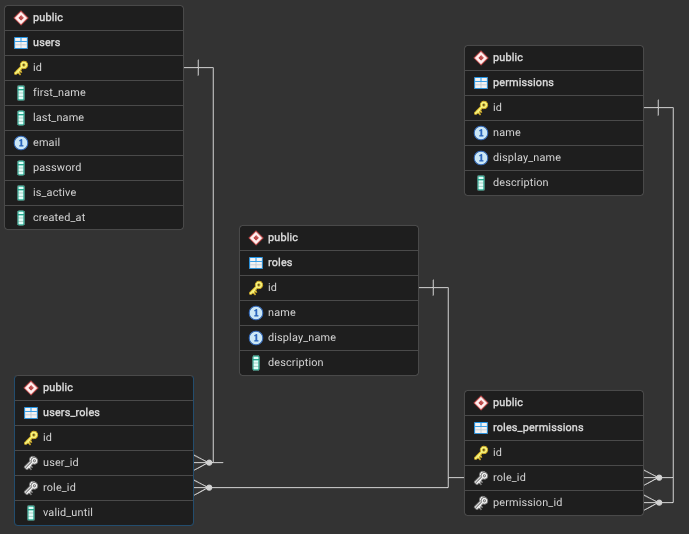

# Система аутентификации и авторизации

REST API для аутентификации пользователей, управления ролями и правами доступа. Базовый URL для всех запросов: http://localhost:8000/api/v1.

## Запуск приложения

Для корректной работы приложения должны быть настроены следующие переменные окружения

| Переменная           | Описание                                                                                         |
| -------------------- |--------------------------------------------------------------------------------------------------|
| SECRET_KEY           | Секретный ключ Django, используется для подписи данных.                                          |
| DEBUG                | Флаг режима отладки Django (по умолчанию True).                                                  |
| JWT_ISSUER           | Идентификатор издателя JWT‑токенов (по умолчанию issuer).                                        |
| JWT_ACCESS_MINUTES   | Время жизни access‑токена в минутах (по умолчанию 5).                                            |
| JWT_REFRESH_DAYS     | Время жизни refresh‑токена в днях (по умолчанию 1).                                              |
| DEFAULT_ROLE         | Роль, назначаемая пользователям по умолчанию при создании (по умолчанию user).                   |
| PERMISSION_SEPARATOR | Разделитель для строкового представления прав (по умолчанию :).                                  |
| DB_NAME              | Имя базы данных PostgreSQL, к которой подключается сервис (по умолчанию auth_db).                |
| DB_USER              | Имя пользователя базы данных, от имени которого подключается приложение (по умолчанию postgres). |
| DB_PASSWORD          | Пароль пользователя базы данных (по умолчанию 123).                                              |

Контейнеры с базой данных (postgresql 16) и самим приложением запускаются при помощи следующей команды
```bash
docker compose up
```
Завершить работу можно при помощи
```bash
docker compose down
```

## Структура управления ограничениями доступа

В приложении используется следующая схема авторизации: JWT‑аутентификация, ролевая модель и проверка отдельных прав на операции с ресурсом.

### JWT-аутентификация

- Клиент аутентифицируется по e-mail и паролю и получает пару токенов: **access‑token** и **refresh‑token**.  
- Access‑token передаётся в заголовке `Authorization: Bearer <ACCESS_TOKEN>` и используется для авторизации.  
- Refresh‑token используется для обновления access‑token без повторного ввода пароля; по истечении access‑token клиент запрашивает новый по `POST /refresh/`.  
- При логауте refresh‑токен удаляется из соответствующей таблицы в базе данных, чтобы запретить дальнейшее обновление access‑токенов.

### Сущности авторизации

- **Permission** описывает атомарное право в виде строки по шаблону `ресурс:действие[:отношение]`. Например, `user:create` — создание пользователя, `item:read:own` — чтение только своих объектов.  
- **Role** объединяет набор прав и описывает тип пользователя (по умолчанию добавлены три роли: админ, менеджер и обычный пользователь).  
- **User** ссылается на одну из ролей, через которую получает определенный набор прав.

### Примеры типового поведения

- **Админ**  
  - Имеет полный набор прав.  
  - Может работать с любыми пользователями и объектами, а также управлять ролями и правами.

- **Менеджер**  
  - Имеет права на просмотр пользователей и полное управление объектами, но не может менять набор системных прав.  
  - Для операций над пользователями доступ ограничен только чтением.

- **Обычный пользователь**  
  - Имеет «own»‑права для пользователя и объектов.  
  - Не может взаимодействовать с чужими объектами и управлять ролями и правами.

### Схема базы данных



